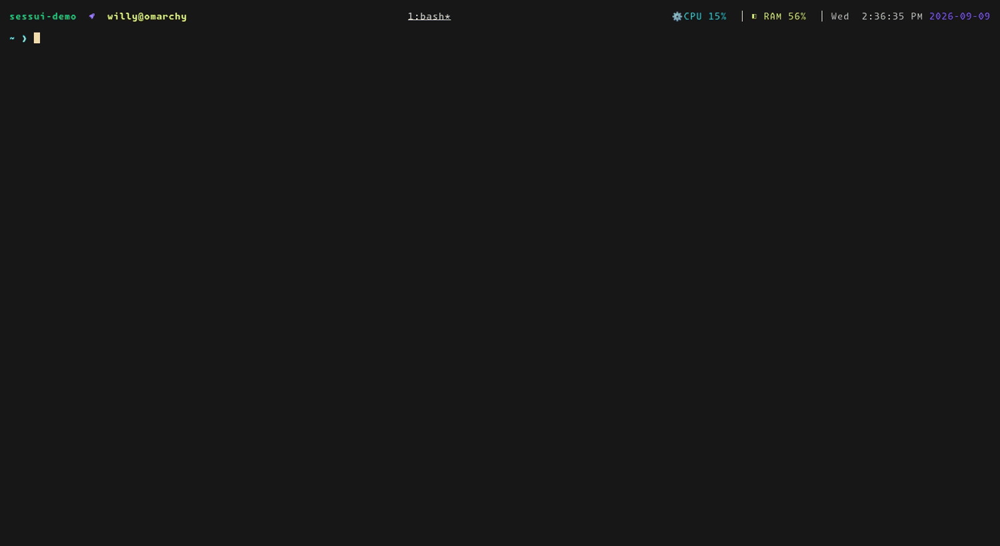

# sessui

A tmux session switcher in a popup. Shows what every session is doing — local
and on your other machines — and gets out of the way.



## Install

**TPM** — add to `~/.config/tmux/tmux.conf`, then `prefix + I`:

```tmux
set -g @plugin 'WillyV3/sessui'
```

**Go:**

```sh
go install github.com/WillyV3/sessui@latest
```

**Neither** — grab a binary from
[releases](https://github.com/WillyV3/sessui/releases/latest), put it on your
PATH, and bind it yourself:

```tmux
bind-key s display-popup -E -w 112 -h 26 sessui
```

Needs **tmux 3.7+**. Earlier versions open the popup but never redraw it.

## Keys

| Key | Does |
|-----|------|
| `↑` `↓` | move |
| any letter | filter — no `/` |
| `enter` | switch, or create a session named by the filter |
| `←` `→` | while creating: pick which machine |
| `ctrl+r` | rename |
| `ctrl+x` | kill |
| `ctrl+e` | settings — columns, width, theme, icons, hosts |
| `esc` | close |

Letters filter, so there are no `j`/`k` keys. Arrows are the nav.

## Other machines

`ctrl+e`, arrow down to **hosts**. Your `~/.ssh/config` is already the list —
`space` watches one and its sessions join the table.

```
hosts   ● ubuntu-homelab   ● inspiron 1   ○ macbook1   ○ raspdeck   ›
```

`●` up · `○` down · `◌` still asking. Reachable machines sort first. Nothing is
polled until you pick something.

`enter` on a remote session attaches over ssh inside a local session named
`host/name`. After that it's a normal local session — instant to switch back to,
and it stops showing twice. Kill and rename work on it too.

Creating: type a name, `←→` to pick a machine, `enter`. Plain `enter` still
creates locally.

**Needs:** `ssh -o BatchMode=yes <host> true` works (key auth, no prompt), and
tmux on the far end. Nothing gets installed there. Since it shells out to `ssh`,
your `~/.ssh/config` does the work — ProxyJump, certs, agent forwarding,
Tailscale names.

## Settings

`ctrl+e` edits the real table, live. `esc` applies, `ctrl+z` throws it away,
`ctrl+r` resets.

Popup size lives in tmux, because tmux needs it before sessui starts:

| Option | Default | |
|--------|---------|--|
| `@sessui-key` | `s` | `prefix + <key>` |
| `@sessui-width` | `112` | the table wants ~112 columns |
| `@sessui-height` | `26` | |

Everything else is `~/.config/sessui/config.json`, written for you by `ctrl+e`:

| Key | Values | |
|-----|--------|--|
| `icons` | `nerd` \| `ascii` | `ascii` for terminals without a Nerd Font |
| `theme.palette` | `auto` \| `dark` \| `light` | `auto` follows [Omarchy](https://omarchy.org) |
| `columns` | `[{"id","width"}]` | which columns, in what order |
| `hosts` | `["alias"]` | machines to watch |

## With cp3

Running [claude-peers](https://github.com/WillyV3/claude-peers)? sessui matches
each session to its peer by directory and adds a `peer` column — up or down,
what it's working on, `✉` when it owes you a reply. No config; it reads
`cp3 peers` if `cp3` is there. Without it the column disappears.

## Docs

[Architecture](docs/ARCHITECTURE.md) · [Gotchas](docs/GOTCHAS.md)

## License

MIT
